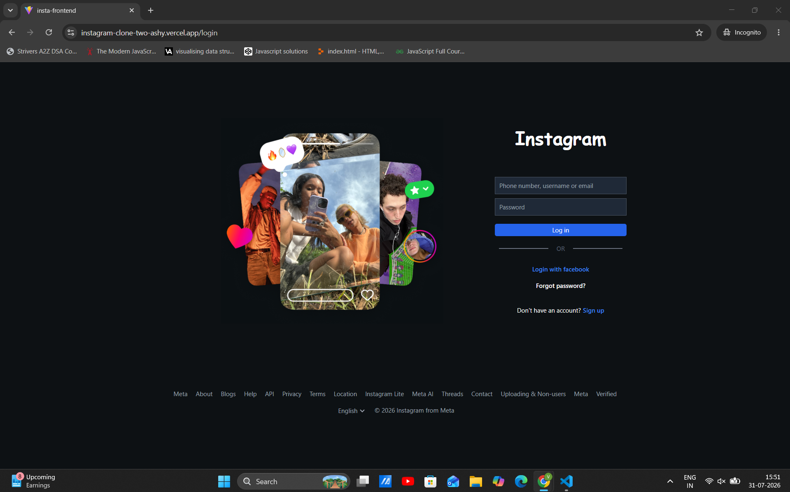
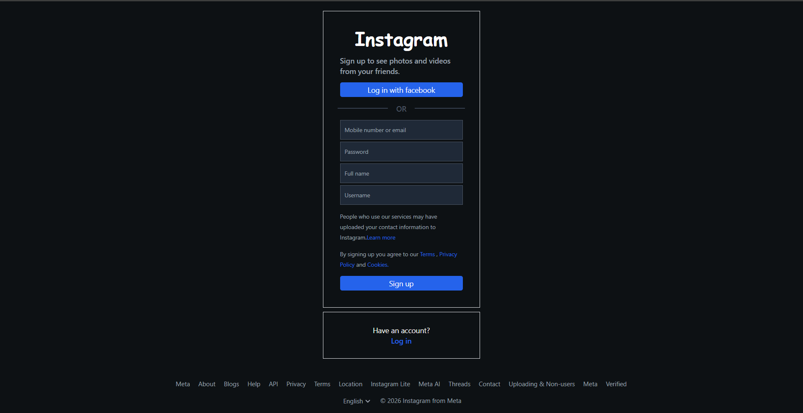
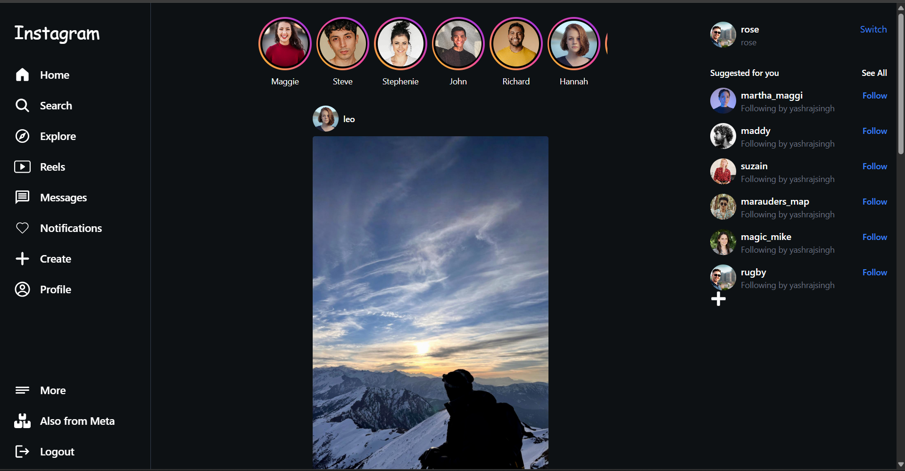
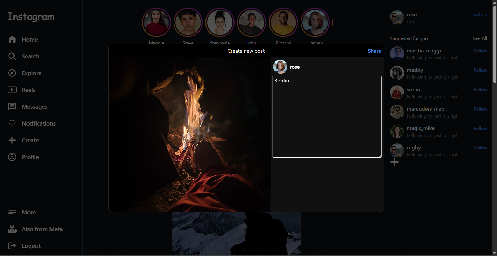
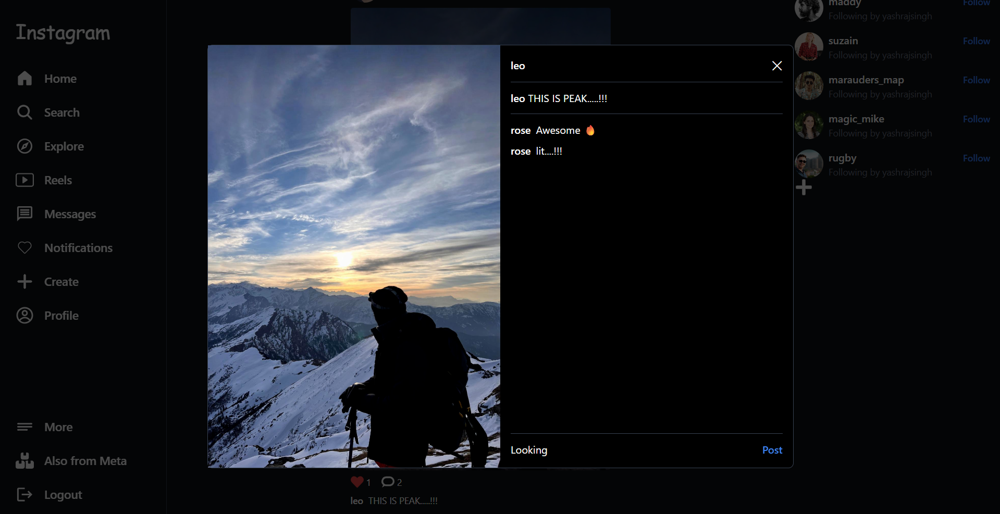
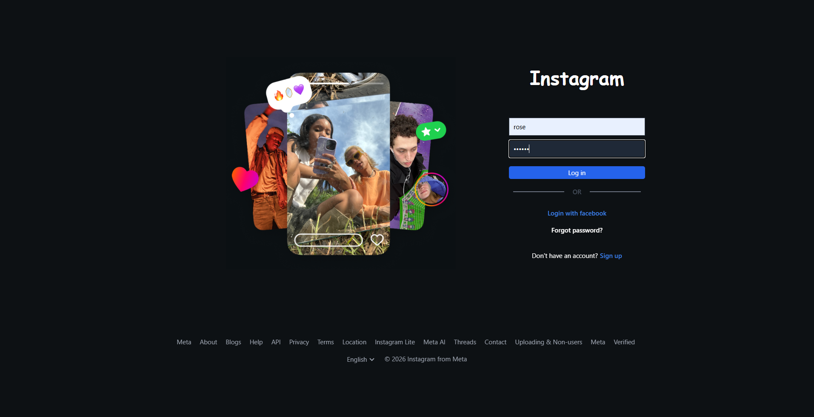

# 📸 Instagram Clone — MERN Full Stack Social Media Platform



A production-ready **Instagram-inspired social media platform** built using the **MERN Stack**.

The application allows users to create accounts, upload images, create posts, like posts, comment, and interact through a modern responsive interface.

This project demonstrates real-world full-stack engineering practices including:

* JWT authentication
* REST API development
* MongoDB database relationships
* Cloudinary image management
* Protected routes
* React component architecture
* Production deployment


---


# 🚀 Live Demo

| Service        | Link                                                     |
| -------------- | -------------------------------------------------------- |
| 🌐 Frontend    | https://instagram-clone-two-ashy.vercel.app              |
| ⚙️ Backend API | https://instagram-clone-zd72.onrender.com                |
| 💻 Source Code | https://github.com/Varshith-kummarikunta/instagram-clone |

---

# ✨ Features

## 🔐 Authentication System

Complete JWT-based authentication flow.

Features:

* User registration
* User login
* Password hashing using bcrypt
* JWT token generation
* Protected API routes
* Persistent login sessions
* Secure authorization middleware

---

# 📝 Post Management

Users can create and manage posts.

Implemented:

* Create posts
* Upload images
* Add captions
* View all posts
* Update own posts
* Delete own posts
* Display author information
* Dynamic post feed

---

# ☁️ Cloudinary Image Upload

Integrated Cloudinary for production image storage.

Image flow:

```
User selects image
        |
        ↓
Frontend uploads image
        |
        ↓
Backend processes file
        |
        ↓
Cloudinary stores image
        |
        ↓
Image URL saved in MongoDB
        |
        ↓
Image displayed in feed
```

Features:

* Cloud-based image storage
* Optimized image delivery
* Persistent image URLs

---

# ❤️ Like System

Instagram-style like functionality.

Features:

* Like posts
* Unlike posts
* Toggle like state
* Dynamic like count
* Animated heart interaction

Built using:

* React state updates
* Framer Motion animations

---

# 💬 Comment System

Complete comment functionality.

Features:

* Add comments
* View comments
* Update own comments
* Instagram-style comment modal
* Auto-focus comment input
* Escape key close
* Outside click close
* Scroll locking

Comment modal design:

```
+---------------------------+
|                           |
|      Post Image           |
|                           |
|---------------------------|
| Username                  |
| Caption                   |
|                           |
| Comments                  |
|                           |
| Add comment               |
+---------------------------+
```

---

# 🎨 User Interface

Built with modern React UI practices.

Features:

* Responsive design
* Instagram-inspired layout
* Dark theme
* Tailwind CSS styling
* Smooth animations
* Component-based architecture

---

# 🏗️ Application Architecture

```
                User Browser

                    |
                    |

        React + Vite Frontend

                    |

              REST APIs

                    |

        Node.js + Express Backend

                    |

             MongoDB Atlas

                    |

              Cloudinary
           Image Storage
```

---

# 🛠️ Tech Stack

## Frontend

* React.js
* Vite
* Tailwind CSS
* React Router DOM
* Context API
* Framer Motion
* Fetch API

## Backend

* Node.js
* Express.js
* MongoDB
* Mongoose
* JWT
* bcrypt
* Multer
* Cloudinary
* CORS

## Deployment

Frontend:

* Vercel

Backend:

* Render

Database:

* MongoDB Atlas

Storage:

* Cloudinary

Version Control:

* Git + GitHub

---

# 📂 Project Structure

```
Instagram_Clone

│
├── insta-backend
│
│   ├── controllers
│   │
│   ├── middlewares
│   │
│   ├── models
│   │
│   ├── routers
│   │
│   ├── utilities
│   │
│   ├── index.js
│   └── package.json
│
│
└── insta-frontend
    │
    ├── src
    │
    │   ├── components
    │   ├── pages
    │   ├── contexts
    │   └── App.jsx
    │
    ├── public
    ├── package.json
    └── vite.config.js
```

---

# ⚙️ Installation & Setup

## Clone Repository

```bash
git clone https://github.com/Varshith-kummarikunta/instagram-clone.git

cd instagram-clone
```

---

# Backend Setup

Navigate:

```bash
cd insta-backend
```

Install dependencies:

```bash
npm install
```

Create `.env`

```env
PORT=8000

MONGODB_URI=your_mongodb_connection_string

JWT_SECRET=your_secret_key

CLOUDINARY_CLOUD_NAME=your_cloud_name

CLOUDINARY_API_KEY=your_api_key

CLOUDINARY_SECRET_KEY=your_secret_key

FRONTEND_URL=http://localhost:5173
```

Run server:

```bash
npm run dev
```

Backend:

```
http://localhost:8000
```

---

# Frontend Setup

Navigate:

```bash
cd insta-frontend
```

Install:

```bash
npm install
```

Create `.env`

```env
VITE_API_URL=http://localhost:8000
```

Run:

```bash
npm run dev
```

Frontend:

```
http://localhost:5173
```

---

# 🔌 API Documentation

## Authentication

| Method | Endpoint  | Description    |
| ------ | --------- | -------------- |
| POST   | `/signup` | Create account |
| POST   | `/login`  | Login user     |

---

## Posts

| Method | Endpoint              | Description      |
| ------ | --------------------- | ---------------- |
| GET    | `/posts`              | Get all posts    |
| POST   | `/posts`              | Create post      |
| POST   | `/posts/like/:postId` | Like/unlike post |
| PATCH  | `/posts/:postId`      | Update post      |
| DELETE | `/posts/:postId`      | Delete post      |

---

## Comments

| Method | Endpoint               | Description    |
| ------ | ---------------------- | -------------- |
| POST   | `/comments/:postId`    | Add comment    |
| GET    | `/comments/:postId`    | Get comments   |
| PATCH  | `/comments/:commentId` | Update comment |

---

# 🚢 Deployment

## Frontend Deployment

Platform:

Vercel

Configuration:

```
Root Directory:
insta-frontend

Framework:
Vite

Build Command:
npm run build

Output:
dist
```

Environment:

```
VITE_API_URL=https://instagram-clone-zd72.onrender.com
```

---

## Backend Deployment

Platform:

Render

Configuration:

```
Root Directory:
insta-backend

Build:
npm install

Start:
npm start
```

Environment variables configured:

* MongoDB URI
* JWT Secret
* Cloudinary credentials
* Frontend URL

---

# 🧠 Engineering Challenges Solved

## Linux Case Sensitivity Issue

Problem:

Application worked locally but failed on Vercel.

Cause:

Windows ignores filename capitalization differences.

Solution:

Fixed imports to exactly match filenames.

Example:

Before:

```
./messageBar
```

After:

```
./MessageBar
```

---

## Production CORS Configuration

Problem:

Frontend requests blocked after deployment.

Cause:

Backend allowed localhost origin.

Solution:

Configured:

```
Frontend: https://instagram-clone-two-ashy.vercel.app
Backend: https://instagram-clone-zd72.onrender.com
Repository: https://github.com/Varshith-kummarikunta/instagram-clone
```

---

# 📸 Screenshots
# 📸 Screenshots

## Login


## Signup


## Home Feed


## Create Post


## Comments Modal


## Profile


---

# 🔮 Future Improvements

Planned:

* [ ] User profile pages
* [ ] Edit profile
* [ ] Follow/unfollow system
* [ ] Followers/following count
* [ ] Infinite scrolling
* [ ] Search users
* [ ] Saved posts
* [ ] Stories
* [ ] Real-time notifications using Socket.io
* [ ] Direct messaging
* [ ] Reels
* [ ] Dark/light theme

---

# 📚 Learning Outcomes

Through this project I implemented:

* Full-stack MERN architecture
* REST API development
* JWT authentication
* Database relationships
* Cloud image storage
* React state management
* Component architecture
* Production deployment
* Debugging real-world deployment issues

---

# 👨‍💻 Author

## Varshith Kummarikunta

B.Tech Computer Science Engineering (2025)

GitHub:

https://github.com/Varshith-kummarikunta

---

⭐ If you found this project useful, consider giving it a star.
